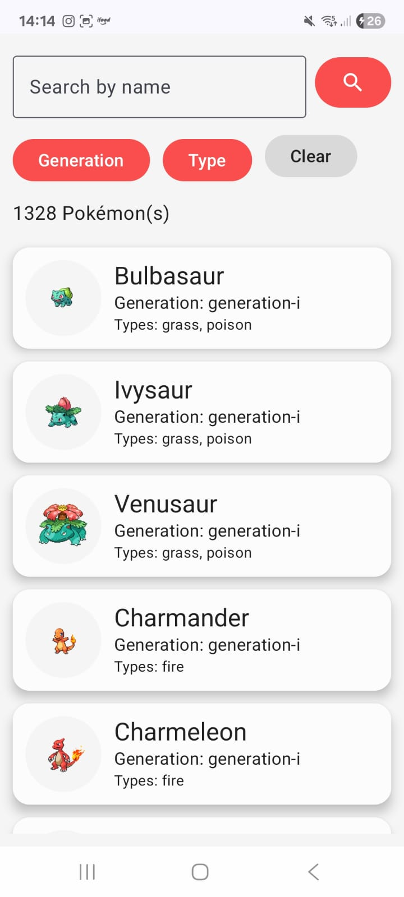

# 📱 Pokedex App

Um aplicativo moderno de Pokédex desenvolvido em **Kotlin** com **Jetpack Compose**, **Retrofit**, e **Glide**.  
Exibe informações completas sobre os Pokémons, incluindo imagem, tipo, estatísticas e geração.

---

## ✨ Funcionalidades

- 🔍 Lista de Pokémons com busca por nome  
- 📄 Tela de detalhes com peso, altura, tipos e stats  
- 🖼️ Exibição de imagens usando **Glide**  
- 🌈 Interface 100% construída com **Jetpack Compose**  
- ⚙️ Consumo da [PokeAPI](https://pokeapi.co/) usando **Retrofit**  
- 🧭 Navegação entre telas com **NavController**

---

## 🧠 Tecnologias Utilizadas

| Tecnologia | Função |
|-------------|--------|
| **Kotlin** | Linguagem principal |
| **Jetpack Compose** | UI declarativa moderna |
| **Retrofit** | Requisições HTTP |
| **Glide** | Carregamento e cache de imagens |
| **Coroutines / Flow** | Programação assíncrona |
| **Material 3** | Estilo visual e temas |

---

## 📸 Screenshots

| Tela Inicial | Tela de Detalhes |
|---------------|----------------|
|  |  |

---

## ⚙️ Estrutura do Projeto

```
com.karoldm.pokedex/
│
├── data/
│ ├── api/
│ ├── models/
│ └── repositories/
│
├── ui/
│ ├── home/
│ ├── details/
│ ├── splash/
│ └── theme/
│
├── navigation/
│ └── AppNavHost.kt
│
└── MainActivity.kt
```

💖 Créditos
Desenvolvido por Karol Marques
